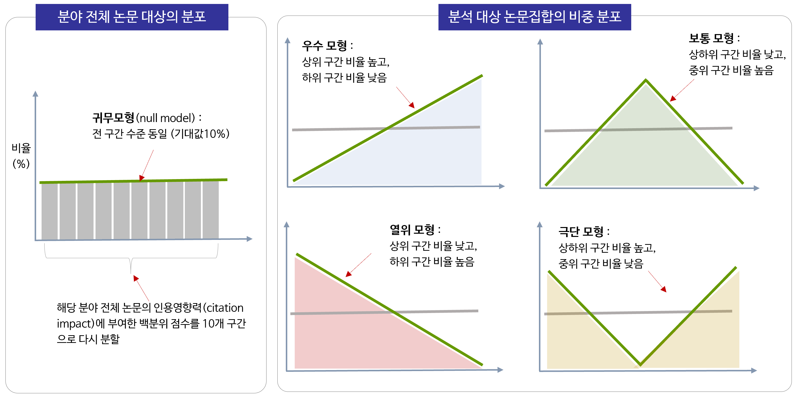

### 학술논문 데이터로 바라 본 글로벌 과학기술연구 수준의 거시적 변동

#### Analysis on the Long-term Trend of Research Excellence in the Global Science and Technology

> 이준영 & 박진서 (2019), KISTI Data Insight 제 7호 http://mirian.kisti.re.kr/index.jsp

 

과학기술 문헌의 인용영향력(Citation Impact)에 대한 분위수 기반의 수월성(Excellence) 지수를 확장하여, 해당 연구주체(연구기관, 국가 등)가 산출한 전체 문헌의 분위수 분포 형태에 대한 분석의 중요성을 새롭게 제시  

---
공개 코드 : percentile_calculation_sample.R
 
**코드의 목차**

* 샘플데이터 반입
* 백분위 계산용 기초 데이터 계산
* 백분위 값과 분위 구간별 비중 계산
* 결과 분석 및 시각화 작업을 위한 데이터 작업
* 최상위 10% 엑셀런스 및 최하위 10% 역엑셀런스 시계열 분석
* 각 분야별 1990년대, 2000년대, 2010년대 분포 변화

---
주의 : 샘플데이터가 대용량(2개 파일 약 780메가바이트)이므로, Github의 `Clone or download` 버튼으로 다운로드시 데이터가 첨부안됨. `data` 폴더에서 개별 파일 다운로드해야 함.     
